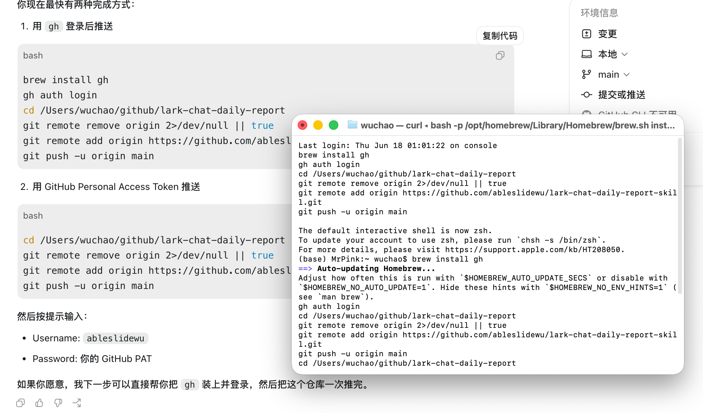
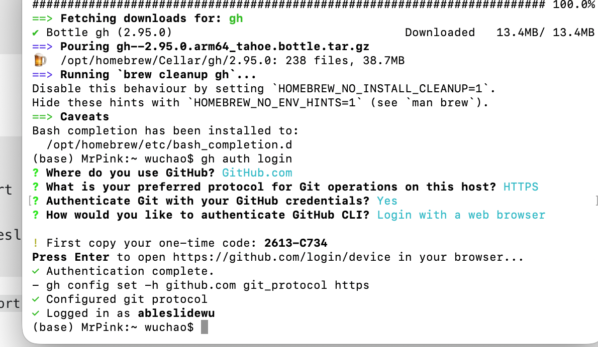
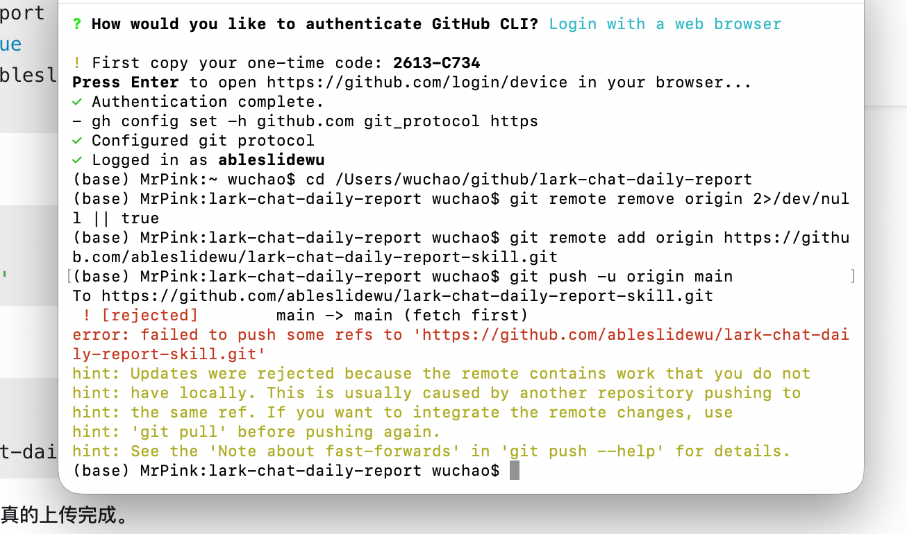

# Lark Chat Daily Report Skill

把指定飞书群在某一天或某一段时间内的消息整理成结构化日报，写回固定飞书文档，并按用户指定的通知对象发送完成卡片。

这个 Skill 适合持续维护活动群日报、社群情报沉淀、嘉宾分享汇总、资料库整理，不适合一次性的随手摘要。

## 这个 Skill 解决什么问题

- 按时间范围拉取群聊全量消息，而不是只看关键词命中
- 同时做关键词补抓，避免漏掉文档、回放、GitHub、教程、资料库等资产
- 扫描图片、文件、卡片消息，补抓有价值的图和附件
- 把整理结果持续写回同一份飞书文档，而不是每天新建一份
- 完成后发卡片通知，但通知给谁、发到哪个群，交给用户自己配置

## 设计原则

- 先检查 `lark-cli` 是否已经授权，再开始执行
- 默认使用用户身份读取群消息和修改飞书文档
- 不预设通知接收人，也不默认通知当前群
- 尽量保留原始链接、发送人、发送时间、消息来源
- 所有本次新增和修改内容使用浅绿色底色标记

## 仓库结构

```text
.
├── SKILL.md
├── README.md
├── agents/
│   └── openai.yaml
├── assets/
│   ├── gh-auth-success.png
│   ├── git-push-conflict.png
│   └── github-push-guide.png
└── references/
    └── demo-day-profile.md
```

## 安装

把这个仓库放进 Codex skill 目录，例如：

```bash
mkdir -p ~/.codex/skills
cd ~/.codex/skills
git clone https://github.com/ableslidewu/lark-chat-daily-report-skill.git lark-chat-daily-report
```

如果你已经有本地目录，也可以直接复制到：

```bash
~/.codex/skills/lark-chat-daily-report
```

## 使用前准备

### 1. 安装 Feishu CLI

这个 Skill 默认依赖 `lark-cli`。

```bash
brew install lark-cli
```

如果你的环境里实际命令名仍是旧的封装或内部版本，请以本机可用命令为准，但流程不变。

### 2. 先检查授权状态

开始执行前先跑：

```bash
lark-cli auth status
```

如果 `user identity` 不是 `ready`，或者 token 失效，就先走授权流程。这个检查是 Skill 的固定前置步骤，不假设使用者已经连好飞书。

示例授权命令：

```bash
lark-cli auth login --scope "search:message im:message:readonly im:message.send_as_user docx:document:readonly docx:document:write_only docs:document.content:read docs:document.media:download docs:document.media:upload"
```

### 3. 让用户自己指定通知目标

这个 Skill 不默认：

- 发给操作者本人
- 发到当前整理的群
- 发给某个固定名字的人

需要由用户明确指定：

- 发给谁
- 发到哪个群
- 用什么身份发

如果用户给过稳定偏好，可以记进自动化记忆；否则每次先确认。

## 典型用法

在 Codex 里直接调用：

```text
Use $lark-chat-daily-report to 整理「某个飞书群」6 月 20 日的消息，更新固定日报文档，并在完成后给我指定的人发送通知卡片。
```

如果是 Demo Day #3 场景，Skill 会额外读取：

- `references/demo-day-profile.md`

这个 profile 里只保留默认群、默认日报文档、关键词、文档结构要求和当前已知权限结论；通知对象不做硬编码。

## 日报输出要求

Skill 默认会确保这些内容被覆盖：

- 必看资产：活动文档、嘉宾文档、回放、妙记、录屏、资源包、报名和投稿链接
- 群主或管理员核心信息：活动时间、日程、通知、后续安排
- 嘉宾分享与案例：身份、主题、Skill 文档、PPT、GitHub、作品集、社媒
- 外部资料和链接：教程站、资料库、指南、文章、播客、社区资源
- 有价值图片：长图、流程图、架构图、案例图、PPT 截图、作品截图
- 群友经验与产品讨论：产品名、Agent 案例、模型替代方案、企业需求
- 待跟进问题

如果某一天确实没有高价值新增，Skill 也会写出“昨日未发现高价值新增信息”。

## 界面截图

### GitHub 推送示例

下面这张图是把独立仓库推到 GitHub 的命令示例：



### GitHub CLI 登录成功

这张图展示 `gh auth login` 完成后的状态：



### 常见推送冲突

如果新仓库里先有网页上传产生的远端提交，直接 `git push` 会遇到这种 `fetch first` 冲突：



这种情况下，先抓远端、合并历史，再推送即可。不要第一反应就强推。

## 后续可补的内容

如果你想把 README 再补完整，下一步最值得加的是：

- 一张飞书日报文档的实际页面截图
- 一张完成后发送卡片通知的截图
- 一段最小可运行的自动化示例

## 仓库地址

[ableslidewu/lark-chat-daily-report-skill](https://github.com/ableslidewu/lark-chat-daily-report-skill)
